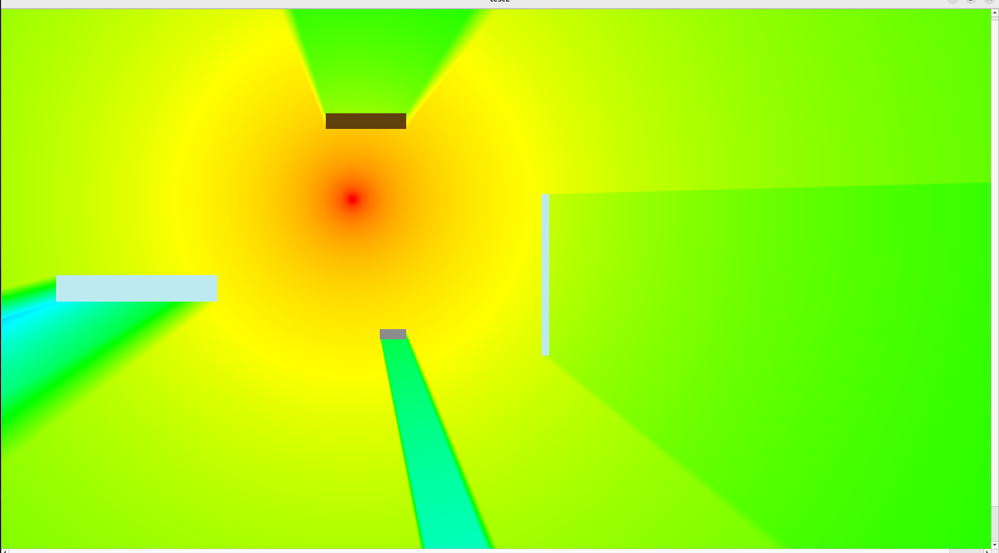

# Visual_prog

## Лабораторная №1

### Добавлен градиент 

Основные цвета:
- ___красный___ - _(255,0,0)_
- ___желтый___ - _(255,255,0)_
- ___зеленый___ - _(0,255,0)_
- ___голубой___ - _(0,255,255)_
- ___синий___ - _(0,0,255)_ 

Связываем 255 с нашим *dbm*, так чтобы в конце получили *0* или *255*.

```c
if(sigPower > -44 ){
    p.setPen(QColor(255,0,0)); // <-- задание цвета
}

else if (sigPower > -84 ) {
    p.setPen(QColor(255,((sigPower+44)*(-1.0)*6.375), 0)); // <-- задание цвета
}

else if (sigPower > -104 ) {
    p.setPen(QColor((255+((sigPower+84)*12.75)), 255,0)); // <-- задание цвета
}
else if (sigPower > -124 ) {
    p.setPen(QColor(0, 255, ((sigPower+104)*(-1.0)*12.75))); // <-- задание цвета
}
else if (sigPower > -144 ) {
    p.setPen(QColor(0, 255+((sigPower+124)*12.75), 255)); // <-- задание цвета
}
```


## Лабораторная №2



## Лабораторная №3

### Рефакторинг - 