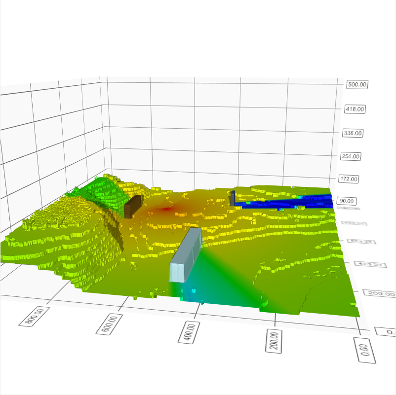

# Visual_prog

##  Распространение сигнала Базовой станции 5G New Radio

-  Проходим по всем точкам каты (1000 на 1000), где рассчитываем потери для каждой точки и выбираем цвет в зависимости от потерь, после чего отрисовываем на карте.

Используемая модель затухания:

PL1


### Для распространения сигнала реализуем градиент

Основные цвета:
- ___красный___ - _(255,0,0)_
- ___желтый___ - _(255,255,0)_
- ___зеленый___ - _(0,255,0)_
- ___голубой___ - _(0,255,255)_
- ___синий___ - _(0,0,255)_ 

Связываем 255 с нашим *dbm*, так чтобы в конце получили *0* или *255*.

```c++
if(sigPower > -44 ){
    p.setPen(QColor(255,0,0)); // <-- задание цвета
}

else if (sigPower > -84 ) {
    p.setPen(QColor(255,((sigPower+44)*(-1.0)*6.375), 0)); // <-- задание цвета
}

else if (sigPower > -104 ) {
    p.setPen(QColor((255+((sigPower+84)*12.75)), 255,0)); // <-- задание цвета
}
else if (sigPower > -124 ) {
    p.setPen(QColor(0, 255, ((sigPower+104)*(-1.0)*12.75))); // <-- задание цвета
}
else if (sigPower > -144 ) {
    p.setPen(QColor(0, 255+((sigPower+124)*12.75), 255)); // <-- задание цвета
}
```


## Лабораторная №2

Случайным образом установим на карте препятствия заранее определяя тип материала: 

1. Стеклопакет
2. IRR стекло
3. Бетон
4. Дерево\гипсокартон

- Формулы степени затухания радиосигнала при прохождении через препятствия разных материалов.


## Лабораторная №3
Рефакторинг кода:

**Класс Heatmap**: в ней создаются карты потерь и препятствий для дальнейших подсчетов и отрисовки

**Класс Propagation_Model**: там должны реализоваться разные модели затухания сигнала, но пока одна.

### Рефакторинг - 

## Лабораторная №4

Был добавлен класс map_3d, который создает 3д карту, основываясь на карте высот, которую мы получили в первом семестре через парсер.

местность: Новосибирск

**Результат визуализации:** включая наложение поверх карты зданий, карты распространения сигнала

